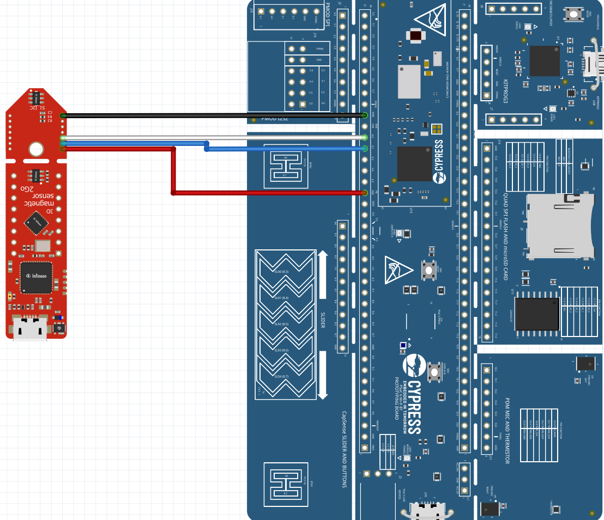
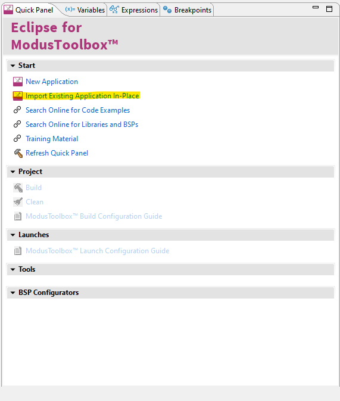
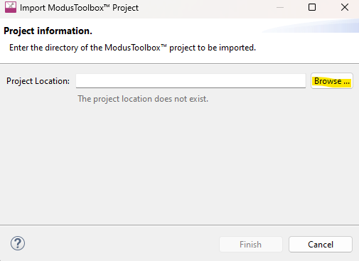
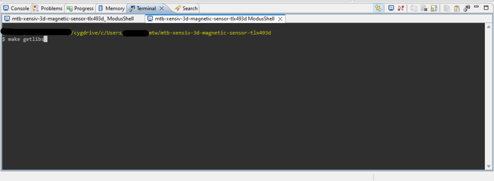
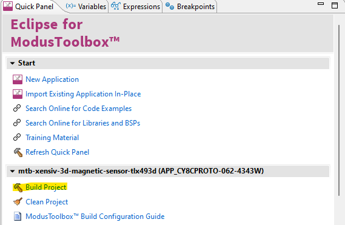
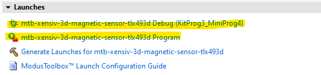
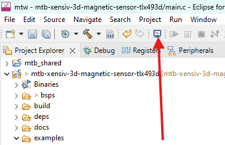
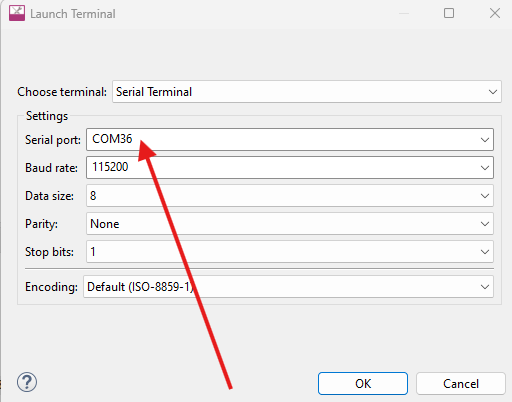
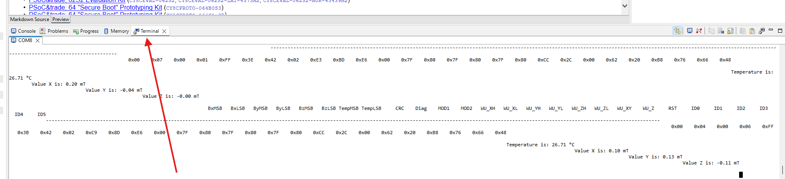

# mtb-xensiv-3d-magnetic-sensor-tlx493d
This repository contains several examples for the XENSIV™ 3D Magnetic Sensor family. It not only includes the sensors core library, which can be found [here](https://github.com/Infineon/xensiv-3d-magnetic-sensor-tlx493d), but also provides the necessary low level wrappers to use the core library within the ModusToolbox™.

> [!IMPORTANT]
> This is not an official example of the ModusToolbox™ and will therefore not be available through the ModusToolbox™ project creation tool. Also the necessary wrappers cannot be obtained through the library manager of the ModusToolbox™. You will find detailed instructions on how to use this repository in the following sections.
This example is compiled for the CY8CPROTO-062-4343W with the TLE493D-P3B6 sensor connected.

## Hardware Connection
| Pin on Sensor | Pin on Microcontroller |
|---------------|------------------------|
| VDD1          | 3.3V / P6 VDD          |
| GND           | GND                    |
| SDA           | P6.1 I2C SDA           |
| SCL           | P6.0 I2C SCL           |


Connect your sensor with your micro controller like in this picture. 
<br>
 




## How to get started
Before you begin, make sure you have ModusToolbox™ installed on your computer. You can download the latest version from the [Infineon ModusToolbox™ website](https://www.infineon.com/cms/en/design-support/tools/sdk/modustoolbox-software/). Follow the installation instructions provided for your operating system.
<br>
This repository contains all necessary files, which are required to setup a working project in the ModusToolbox™. Therefore, the first step is to clone this repository into the desired location on your computer. To make things easier you can simply clone the repository in your default project folder of the ModusToolbox™. On a windows machine it is usually the following location:
```
C:\Users\yourUsername\mtw
```

If you have configured any other default location you can use it instead. You can clone the repository with the following command:

```
git clone https://github.com/Infineon/mtb-xensiv-3d-magnetic-sensor-tlx493d.git
```

Or get a .ZIP-file directly from Github, unpack the .ZIP-file, and put it in the corresponding folder.
With that done, you can now open the ModusToolbox™ and click on *"Import Existing Application In-Place"* in the lower, left corner:



Now you should she the following window. Here you have to click on *"Browse ..."*:



Now you should see you file explorer. Here, you have to select the repository folder and click on *"Select Folder"*. After a few seconds the project should be included and you should be able to see it in the "Project Explorer" of the ModusToolbox™. If everything worked out so far you just have to do a double-click on the folder in the "Project Explorer". This will set the project as active project. Now you should the options "Build Project" and "Clean Project" in the "Quick Panel" of the ModusToolbox™. Before you can build the project successfully, you have to get the resources of the core library. This can easily be done with the following command:
```
make getlibs
```

The easiest way to execute this command is using the integrated terminal of the ModusToolbox™. It can be found at the bottom of the interface. Here is a picture of it:



With that done you can now build the project with the "Build Project" button in the "Quick Panel" of the ModusToolbox™.



This will build your project and will also gather all necessary resources, for example the core library of the XENSIV™ 3D Magnetic sensors. After you have successfully build the project you should now the see the options to "Program" or "Debug" the selected project in the "Quick Panel" tab of the ModusToolbox™:



Now you can connect your PSOC® to your PC and choose either of the two options to deploy the code to the hardware.

## Integrate library into existing ModusToolbox™ project
If you already have an existing ModusToolbox™ project and want to add the library to it, then you have to do the following steps:

- First of all clone the repository into your desired location.
- Then you have to copy the complete folder *libs/mtb-xensiv-3d-magnetic-sensor-tlx493d-wrapper* from the cloned repository into your project, here it is not important where you put it.
- In order to use the ModusToolbox™ drivers we need to add the core library of the XENSIV™ 3D Magnetic Sensor family to the project as well. This can easily done by creating the necessary file in the *deps* folder of your project.
- Execute the command `make getlibs` again to retrieve the necessary resources.

After you did the steps mentioned above, you're ready to use the library with all its features.

## Choose a different example
With the steps mentioned in the "How to get started" section you will build the default example, which is a very simple I2C example for the TLE493D-P3B6 of the third generation. Following, is an explanation on how you can change the example to your desired one. In order to do that, you simply have to change the value of the `#define EXAMPLE` to the desired example. You can see a list of all available examples in the enumeration ` examples_t `. The documentation of each example can be found the in corresponding folders directly in the code.

Whenever you have decided for a desired example and changed the code accordingly, you can simply re-build the project and program your connect hardware again.

## Viewing 3D Magnetic Values in the Serial Monitor in ModusToolbox™

To view the 3D magnetic values, open the Serial Monitor by clicking on the terminal button located at the top of the interface, as shown in the image below.



After opening the Serial Monitor, select the appropriate COM port from the dropdown menu. Ensure that the correct port corresponding to your device is chosen.
<br>
Click "OK" to confirm your selection.



Navigate to the terminal button located at the bottom right of the interface.
<br>
Click on this button to open the COM window, where you will be able to view the 3D magnetic values.




## Supported Kits
The library was tested with the following boards, but should be compatible with all boards, which support the PSOC6™ HAL.

* [PSOC™ 6 Wi-Fi Bluetooth® Prototyping Kit (CY8CPROTO-062-4343W)](https://www.infineon.com/cms/en/product/evaluation-boards/cy8cproto-062-4343w/)
* [PSOC™ 62S2 Wi-Fi BT Pioneer Kit (CY8CKIT-062S2-43012)](https://www.infineon.com/cms/de/product/evaluation-boards/cy8ckit-062s2-43012/)
* [PSOC™ 6 Artificial Intelligence Evaluation Kit (CY8CKIT-062S2-AI)](https://www.infineon.com/cms/en/product/evaluation-boards/cy8ckit-062s2-ai/)

> [!WARNING]
> If you choose a different PSOC™ kit for your project, other than the boards mentioned above, you have to make sure to use valid pins for the I2C and SPI communication interface. Otherwise, there is a chance that the device will not function properly.

[Here](https://documentation.infineon.com/psoc6/docs/bnm1651211483724/index.html) you can find an overview of all the PSOC™ 6 MCU datasheets. In the section "Pinouts" you can usually find a good overview which pin is available for which functionality (e.g. UART, SPI, I2C).